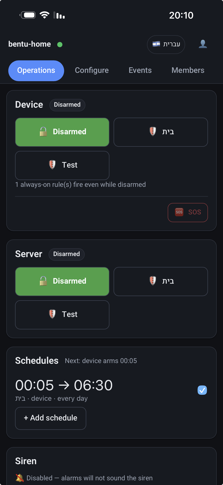
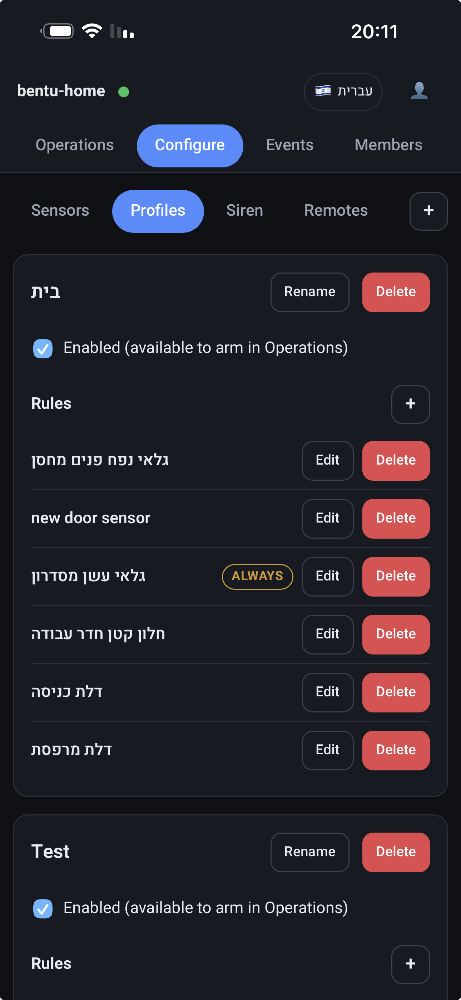

# Alarm System

A self-owned home alarm system built around an ESP32-S3 and a CC1101 433MHz
radio. It listens to off-the-shelf Kerui door/window/PIR sensors, evaluates
alarm rules locally, drives a siren over RF, and reports to Firebase — with no
dependency on the vendor's cloud.

> [!WARNING]
> **This is a hobbyist project, not a certified security product.** It carries
> no UL, EN 50131, or any other listing, and it should not be relied upon as
> your only protection for anything you actually care about. Read
> [SECURITY.md](SECURITY.md) before deploying it — it documents real, known,
> unfixed weaknesses, including an unauthenticated LAN control endpoint and no
> defence against RF jamming.

## Why

Commercial 433MHz alarm kits are cheap and the sensors are genuinely fine
hardware. The hub is the problem: it routes everything through a vendor cloud
you don't control, can't audit, and that can be discontinued from under you.

The sensors speak a simple, documented-by-measurement OOK protocol. So the hub
is the only part worth replacing — this project is that replacement. The
sensors and siren stay; the cloud dependency goes.

## What it does

- **Receives** Kerui 433MHz sensor packets continuously, interrupt-driven
- **Evaluates** alarm rules locally — five condition types, OR'd per profile
- **Fires** the siren directly over RF using a clean-room EV1527 encoder; no hub
- **Reports** events, state, and alarm causes to Firebase; alerts via Telegram
- **Keeps working offline.** Arm state and config live in EEPROM. A device with
  no WiFi still detects intrusion and sounds the siren. This is the central
  design decision — the cloud is a reporting channel, never a dependency.
- **Serves a LAN web UI** at `http://alarm.local` for arm/disarm and testing,
  fully functional with no internet
- **Supports 433MHz key-fob remotes** for arm, disarm, and a panic button that
  works even while disarmed — no phone or network needed
- **Arms on a schedule**, and arms the device and the server independently
- **Speaks English and Hebrew**, with full RTL layout support
- **Costs under $15 in parts** and stays inside the Firebase free tier —
  [details](#cost)

## Screenshots

| Operations | Configure → Profiles |
|---|---|
|  |  |

Screenshots from a live installation. **Device** and **Server** arm
independently, so the alarm is controllable whether the device or the cloud is
the thing that is reachable. The `ALWAYS` badge marks a rule that fires even
while disarmed — a smoke detector, here. The UI is fully localised and
supports RTL.

## Audience

This is a **reference implementation**, not a turnkey product. It is tuned to
one specific set of hardware: a Kerui W184 hub's sensor family, a YF-SG-081
siren, and one CC1101 module wired a particular way. Expect to adapt it.

What transfers even if your hardware differs: the 433MHz decode approach, the
EV1527 transmit path (which took real effort to get right), the offline-first
architecture, and — most of all — [`docs/history/`](docs/history/), which
records what was measured, what was ruled out, and which traps cost days.

## Architecture

```
  433MHz sensors                    ┌──────────── Firebase ────────────┐
  + key-fob remotes                 │                                  │
  (Kerui, EV1527)                   │  RTDB      events, state,        │
        │ OOK                       │            config, commands      │
        ▼                           │                                  │      ┌──────────┐
  ┌───────────┐                     │  Firestore users, projects,      │      │ Telegram │
  │  CC1101   │                     │            sensors, rules        │      │  alerts  │
  │  433MHz   │                     │                                  │─────►│          │
  └─────┬─────┘                     │  Functions device auth, alarm    │      └──────────┘
        │ SPI + GDO0                │            eval, Telegram,       │   sent by Functions,
        ▼                           │            one cron dispatcher   │   not by the web app
  ┌─────────────────────┐           │                                  │
  │     ESP32-S3        │  HTTPS    │  Hosting   the React web app     │
  │                     │◄─────────►│                                  │
  │  decode → rules     │  poll 5s  └──────────────┬───────────────────┘
  │  → siren → report   │                          │
  │                     │                          ▼
  │  EEPROM: arm state, │                   ┌─────────────┐
  │  config, siren addr │                   │  Web app    │
  └──────┬──────────┬───┘                   │  React + TS │
         │          │                       └─────────────┘
         │ RF       │ HTTP (LAN)              configures the bot
         ▼          ▼                         token + chat id
     ┌───────┐  ┌──────────────┐
     │ Siren │  │ alarm.local  │
     └───────┘  │ arm/disarm   │
                └──────────────┘
```

**The important property:** everything inside the ESP32-S3 box works with the
entire right-hand side of that diagram unreachable. WiFi loss is treated as a
normal condition, not an error — the device waits two hours before even
considering a reboot, because a rebooting alarm is a worse alarm.

### Components

| Part | Path | Stack |
|---|---|---|
| Edge firmware | `firmware/edge/device` | C++ / Arduino / PlatformIO |
| RF decoder | `firmware/edge/kerui_decoder.h` | Header-only, unit-tested natively |
| Cloud functions | `functions/` | TypeScript, Firebase gen-2 |
| Web app | `web/` | React + TypeScript + Vite |
| Diagnostic spikes | `firmware/edge/spike_*` | Throwaway sketches, kept as known-good controls |

## Hardware

| Component | Notes |
|---|---|
| ESP32-S3 DevKitC-1 | 16MB flash. **An ESP8266 will not work** — [why](docs/history/esp8266-abandoned.md) |
| CC1101 433MHz module | With SMA antenna. ⚠️ 3.3V only — 5V destroys it |
| Kerui 433MHz sensors | Door/window, PIR. 24-bit OOK |
| Siren (YF-SG-081 or similar) | EV1527, paired directly over RF |
| 433MHz key-fob remotes | *Optional.* Up to 8. Arm/disarm/panic — [details](#remote-controls) |

### Cost

**The replacement hub costs under $15 to build.** An ESP32-S3 DevKitC-1 is
roughly $8–12 and a CC1101 module with antenna is $3–5 from the usual
marketplaces, plus jumper wires. That replaces the commercial hub outright —
the sensors and siren you already own are reused as-is.

**Running it costs nothing in practice.** A single device sits well inside the
Firebase free tier:

| Resource | This project | Free tier |
|---|---|---|
| RTDB ops | ~0.8M/mo (5s config poll + 10s heartbeat) | 1GB stored, 10GB/mo transfer |
| RTDB egress | ~0.2–0.3 GB/mo | 10 GB/mo |
| Function invocations | ~43k/mo (one cron, every minute) | 2M/mo |
| Hosting | a few MB of static assets | 10 GB stored, 360 MB/day |

That is around 2–3% of the transfer allowance and roughly 2% of the function
invocation allowance, before counting event writes — which are driven by real
sensor activity and are negligible at household volumes.

> [!NOTE]
> Cloud Functions gen-2 requires the **Blaze** (pay-as-you-go) plan, so Firebase
> asks for a card even though the free-tier allowances above still apply and
> your bill stays at zero. Set a budget alert if that makes you uneasy.

Full pinout, including **the ESP32-S3 pins you must not use**, is in
[`docs/hardware-wiring.md`](docs/hardware-wiring.md). Read the "Check BEFORE
applying power" section — skipping it destroyed a CC1101 and an ESP32-S3 here.

## Setup

Three independent parts. The firmware works without the other two, so if you
only want local alarm behaviour, stop after step 1.

### Prerequisites

- [PlatformIO Core](https://platformio.org/install/cli) (`pio`)
- Node.js 20+
- A Firebase project on the Blaze plan (Functions gen-2 requires it), only if
  you want the cloud side

### 1. Firmware

```bash
cd firmware/edge/device

# Only needed for the cloud path — skip for a local-only device.
cp platformio.local.ini.example platformio.local.ini
# then fill in FIREBASE_WEB_API_KEY from your Firebase console

# ALWAYS pass -e esp32s3. A bare `pio run` also builds [env:native],
# which fails to link.
pio run -e esp32s3 -t upload --upload-port /dev/cu.usbmodem101
pio run -e esp32s3 -t uploadfs --upload-port /dev/cu.usbmodem101

pio test -e native   # 127 unit tests, no hardware needed
```

On first boot the device has no WiFi credentials, so it opens an access point
named `AlarmSystem-Setup`. Connect to it and a captive setup page collects your
SSID, password, and API key.

> The `esp32s3` build runs `patch_firebase.py` first, which patches a
> [read-timeout bug](docs/history/firebaseclient-sync-read-timeout.md) in the
> FirebaseClient library. This is deliberate. If a library update moves the
> code it anchors on, the patch **fails the build by design** rather than
> silently leaving the fault in — update the anchors, don't remove the script.
> Tracking [FirebaseClient#333](https://github.com/mobizt/FirebaseClient/issues/333).

### 2. Firebase

```bash
# Point at your own project
echo '{"projects":{"default":"YOUR-PROJECT-ID"}}' > .firebaserc

cd functions && npm install && npm run build && cd ..
firebase deploy --only functions,firestore,database
```

Enable **Email/Password** auth in the Firebase console, then create your first
user document at `/users/{your-email}` in Firestore. Access is invite-only;
there is no open sign-up by design.

> [!IMPORTANT]
> **Cloud Scheduler allows only 3 free jobs per billing account.** This project
> uses exactly one: `doSchedule` runs every minute and dispatches a declarative
> table of tasks. If you need new periodic work, **add a row to that table** —
> do not add another `onSchedule()`.

### 3. Web app

```bash
cd web
npm install
cp .env.example .env.local    # fill in from your Firebase console
npm run dev                   # or: npm run build && firebase deploy --only hosting
```

### 4. Pair the siren and sensors

Pairing is **driven from a web UI**, and the siren works the same way the
sensors do: it pairs to the ESP32-S3, and the commercial hub is never part of
the process. Two UIs can do it, both talking to the same firmware:

- **The cloud web app** — Configure → Siren tab, which writes a `pair` command
  the device picks up on its next poll. Sensors are named here too, from the
  unknown IDs the device has logged.
- **The LAN page** at `http://alarm.local` — a "Pair siren" button that works
  with no internet at all.

Put the siren into learn mode first: **hold SET until its lights come on**,
then start pairing from either UI. The device transmits for 10 seconds and the
siren beeps twice once it has learned the address.

> [!NOTE]
> The alarm **cannot hear sensors during those 10 seconds** — the radio is
> transmitting, so reception is off. Pair while disarmed.

If the strobe flashes but there is no sound, the binding went strobe-only —
re-pair. Details in [`docs/history/siren-hub-free.md`](docs/history/siren-hub-free.md).

### 5. Pair a remote (optional)

Same idea, from the Remotes tab or the LAN page's "Pair remote" button: it
opens a 30-second window, and the first fob you press during it is adopted.
Unlike siren pairing this one is receive-only, so **the alarm keeps listening
to sensors throughout**. See [Remote controls](#remote-controls).

## Alarm rules

Rules live under a **profile**, which is armed independently on the device and
on the server. Rules within a profile are OR'd, and a sensor may appear in
several rules.

| Condition | Fires when |
|---|---|
| `immediate` | A single trigger arrives |
| `count_in_window` | N triggers within W seconds |
| `entry_delay` | After a grace period, if not disarmed |
| `multi_sensor` | Several sensors each hit their count within one shared window (AND) |
| `always` | A single trigger, **even while disarmed** (smoke, panic button) |

> [!CAUTION]
> `count_in_window` and `multi_sensor` counts above **8** can never fire — the
> trigger history is a fixed 8-slot array. The web UI does not currently stop
> you entering 9, and a rule configured that way silently never alarms. See
> [SECURITY.md](SECURITY.md#known-issues).

## Remote controls

Up to **8** cheap 433MHz key-fob remotes can be paired, giving you arm, disarm,
and panic with no phone, no app, and no network. They use the same fixed-code
family as the sensors, so they need no extra hardware — the top 20 bits of each
24-bit code identify the remote and the bottom nibble says which button.

| Button | Action |
|---|---|
| Arm | Arms using the config currently loaded. It does **not** select a profile |
| Disarm | Disarms |
| SOS | Panic — sounds the siren and reports an alarm **even while disarmed** |
| S ("arm home") | Decoded, then deliberately ignored |

A remote is treated as a *control* device, never a trigger: a paired remote's
packets are routed away from the rule engine entirely, so a remote can never
satisfy an alarm rule or be logged as a sensor trigger.

Alarms name which remote acted (`remote:E45CA`), so the timeline and Telegram
alerts say *which* fob disarmed the house rather than just that one did.

SOS is also available in the web app's Operations page, where it needs two
presses to fire so a stray tap cannot set off the siren.

Pair from the web app's Remotes tab, or from `http://alarm.local` with a
30-second window; press any button on the fob during it.

> [!IMPORTANT]
> **Pairing a remote is refused while the system is armed.** Otherwise anyone
> in RF range could pair their own fob against an armed system and immediately
> disarm it. Disarm first, then pair.

## Development

```bash
# Firmware — native unit tests, no hardware
cd firmware/edge/device && pio test -e native

# Web
cd web && npm run lint && npm test && npm run build

# Functions
cd functions && npx tsc --noEmit && npx vitest run && npm run build

# Emulator smoke tests
firebase emulators:start &
cd smoke && node fire.mjs
```

Bench testing a running device over the LAN:

```bash
curl -s http://alarm.local/status
curl -s -X POST "http://alarm.local/trigger?rfId=0x2E5B73"
```

Decoding a crash address:

```bash
~/.platformio/packages/toolchain-xtensa-esp32s3/bin/xtensa-esp32s3-elf-addr2line \
  -pfiaC -e .pio/build/esp32s3/firmware.elf 0x42000abc
```

## Documentation

[`docs/history/`](docs/history/) holds dated investigation records. Each one
documents measurements that took days to establish — read the relevant file
before re-investigating anything it covers.

| Doc | Covers |
|---|---|
| [esp8266-abandoned](docs/history/esp8266-abandoned.md) | Why the D1 Mini was dropped: stack exhaustion, TLS budget, heap fragmentation |
| [esp32-s3-port](docs/history/esp32-s3-port.md) | The port that unblocked event writes; USB CDC, PSRAM, partition gotchas |
| [cc1101-receive](docs/history/cc1101-receive.md) | Kerui protocol timing and interrupt-based decode |
| [cc1101-transmit](docs/history/cc1101-transmit.md) | TX via FIFO not GDO0; FREND0; the gap-not-pulse finding |
| [siren-hub-free](docs/history/siren-hub-free.md) | Clean-room EV1527 that actually drives the siren; pairing and command codes |
| [alarm-cause-telegram](docs/history/alarm-cause-telegram.md) | Naming what caused an alarm; the `siren_active` latch bug |
| [watchdog-and-offline-alerts](docs/history/watchdog-and-offline-alerts.md) | The 28h silent death, watchdog, boot reporting |
| [cloud-auth-silent-death](docs/history/cloud-auth-silent-death.md) | A dead auth session no watchdog can see |
| [tls-handshake-watchdog-reboot](docs/history/tls-handshake-watchdog-reboot.md) | 120s TLS handshake vs a 60s watchdog; `vTaskDelay` does not feed the TWDT |
| [firebaseclient-sync-read-timeout](docs/history/firebaseclient-sync-read-timeout.md) | Why `setSyncReadTimeout` could never fire, and two wrong fixes first |

Design specs and implementation plans are in [`docs/superpowers/`](docs/superpowers/).

## Status

**Working on hardware.** The device boots, provisions WiFi, mints its Firebase
token, decodes real sensors, evaluates rules, drives the siren hub-free, serves
the LAN UI, and writes events with Telegram alerts confirmed. 127 native unit
tests pass. Longest verified clean run: **18h16m**, single boot, zero watchdog
reboots, flat heap.

**Known gaps** — the device-liveness and offline-alert work is committed but
not yet hardware-tested; the Telegram webhook is not registered, so bot
commands do not work; and there is no event buffering, so events during an
outage are lost by design. Full list in [SECURITY.md](SECURITY.md) and
`todo.txt`.

## Legal

MIT licensed — see [LICENSE](LICENSE).

The 433MHz protocol support here is clean-room work: the Kerui decoder and the
EV1527 siren encoder were both derived from timing measurements of RF signals
taken with our own receiver and oscilloscope, for the purpose of
interoperating with hardware we own. No vendor firmware was decompiled and no
vendor code is included. EV1527 is a generic, widely documented encoding.

Not affiliated with, endorsed by, or connected to Kerui, Tuya, or any sensor
manufacturer. Product names are trademarks of their respective owners, used
only to identify the hardware this interoperates with.
